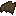

# Overhaul

This mod aims to add a lot of new features to the game while maintaining the "vanilla feel". It contains some of my
favourite ideas from minecraft suggestions reddit, as well as some of my own ideas.

## Features

### Additions

#### Items
*  **Bat wing** - dropped by bats upon death.
  Can be used as potion ingredient. When eaten, restores 1 hunger and 0.2 saturation and applies Poison II effect for
  5 seconds.

#### Status effects
*  **Gliding** - players glide in the air
  as if they had an elytra.
*  **Stickiness** - decreases jump
  velocity.

#### Potions
* **Potion of Gliding, Splash Potion of Gliding, Lingering Potion of Gliding** - brewed by adding Bat Wing to an Awkward
  Potion. Gives **Gliding** status effect. Effect duration can be extended with redstone dust.
* **Potion of Stickiness, Splash Potion of Stickiness, Lingering Potion of Stickiness** - brewed by adding Fermented
  Spider Eye to a Potion of Gliding. Gives **Stickiness** status effect. Effect duration can be extended with redstone
  dust. Strength can be increased with glowstone dust.

### Changes

#### Loot
* Bats now drop 0-1 bat wings upon death. Upper limit is increased by one for each level of Looting.

#### Trading
* Wandering Traders now have a 10% chance of selling a map leading to a random location within a 12800x12800 area around
  them. The map is labeled with the biome name. If you are lucky, you can get a map of a rare biome. This includes
  underground biomes.
* If all of the Wandering Trader's offers has been disabled, it converts to an unemployed villager.

## Credits

* [Wandering traders should have a small chance of selling you a map to rare biomes like Mushroom, Mesa and Jungle.](https://www.reddit.com/r/minecraftsuggestions/comments/htbm63/wandering_traders_should_have_a_small_chance_of/)
* [If you buy a wandering trader's whole stock, he moves in and becomes a villager.](https://www.reddit.com/r/minecraftsuggestions/comments/nf8edj/if_you_buy_a_wandering_traders_whole_stock_he/)
